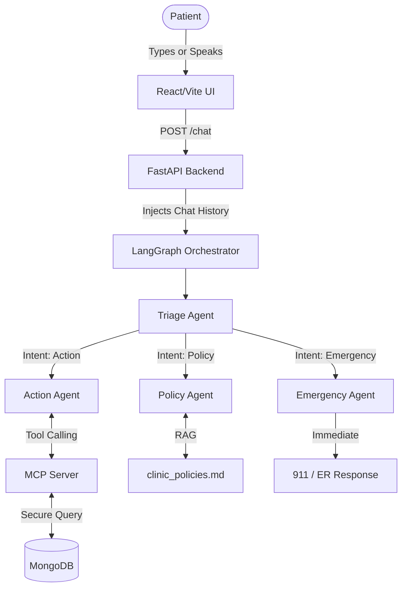

# MedBot: Building an Autonomous, Multi-Agent Medical Receptionist

**Abstract**  
When we set out to build MedBot, our goal was simple: take the heavy administrative burden off medical clinics without losing the human touch. Traditional chatbots are often frustrating because they forget context, can't actually *do* anything (like securely access a database), and fail catastrophically during medical emergencies. MedBot solves these problems by using a team of specialized AI agents working together behind the scenes, securely connected to real clinic data, and rigorously tested to ensure patient safety. This paper breaks down how we built it, the architecture we designed, how we test it, and the hard lessons we learned along the way.

---

## 1. System Architecture

To make MedBot both conversational and deterministic, we completely avoided a monolithic "do-everything" AI model. Instead, we built a **Multi-Agent Orchestration Engine** using LangGraph, and a **Secure Data Layer** using the Model Context Protocol (MCP).

### A. The Orchestration Engine (LangGraph)
Think of LangGraph as the traffic cop of the system. Instead of hoping the AI figures out what to do, we force the conversation through a strict state machine.

Every time a patient sends a message, it enters the **Triage Agent**. The Triage Agent's *only* job is to look at the message (and the recent conversation history) and route it to one of three specialists:
1. **The Action Agent:** Handles booking, cancelling, or rescheduling appointments.
2. **The Policy Agent:** Answers questions about hours, insurance, and medical prep (like fasting).
3. **The Emergency Agent:** A hardcoded safety net that bypasses all normal logic if it detects words like "chest pain" or "bleeding".

### B. The Secure Data Layer (MCP)
LLMs shouldn't talk directly to databases. To bridge the gap between our Action Agent and our MongoDB patient records, we used the **Model Context Protocol (MCP)**. MCP acts as a secure, standardized API layer. The Action Agent can only use the exact tools we expose through MCP: `book_appointment`, `cancel_appointment`, `reschedule_appointment`, and `get_patient_details`. 

---

## 2. Core Use Cases

By dividing the labor among specialized agents, MedBot gracefully handles complex, multi-turn conversations.

**Use Case 1: Multi-Turn Appointment Booking**  
Patients rarely provide all their information at once. 
*   **Patient:** "I want to book an appointment." *(Triage routes to Action)*
*   **MedBot:** "I can help with that. What is your patient ID and preferred date?"
*   **Patient:** "My ID is 23456, and I want to come in the day after tomorrow."
*   *Behind the scenes:* The backend injects the full chat history into the state. The Action Agent remembers the intent, parses the vague date, formulates a precise JSON tool call via MCP, and books the appointment in MongoDB.

**Use Case 2: Instant Emergency Escalation**  
*   **Patient:** "I have severe chest pain and can't breathe."
*   *Behind the scenes:* The Triage Agent flags this as an emergency. It skips the MCP layer entirely. Within milliseconds, the Emergency Agent responds instructing the patient to dial 911 or go to the nearest ER.

**Use Case 3: Policy Inquiry (RAG)**  
*   **Patient:** "Do I need to fast before my blood test tomorrow?"
*   *Behind the scenes:* The Policy Agent searches the local `clinic_policies.md` file and informs the patient of the 8-hour fasting rule, without ever attempting to query the MongoDB database.

---

## 3. Testing and Evaluation Framework

In healthcare software, "move fast and break things" is not an acceptable motto. We needed mathematical proof that the bot wouldn't hallucinate an appointment or ignore a medical crisis. We built a robust **5-Layer Evaluation Framework**.

### The 5 Testing Layers
1.  **Layer 1 (Unit Tests):** We use `mongomock` to test the MCP database tools in total isolation. No LLM, no real network. Runs in milliseconds.
2.  **Layer 2 (Integration Tests):** Tests the FastAPI endpoints and our custom session memory system.
3.  **Layer 3 (End-to-End Scenarios):** Full simulated conversations using the real LLM and the real MongoDB. We simulate a user booking an appointment, then check the database to ensure the record was actually created.
4.  **Layer 4 (LLM-as-Judge Evaluation):** A batch script that runs a "golden dataset" of 40 varied messages through the system. We use a secondary LLM to grade MedBot's responses out of 5 based on a strict rubric.
5.  **Layer 5 (Performance & Concurrency):** Stress tests the system with simultaneous virtual users to ensure one patient's session doesn't accidentally bleed into another patient's session.

### Evaluation Metrics & Targets

| Metric | Description | Target |
| :--- | :--- | :--- |
| **Intent Accuracy** | How often the Triage Agent correctly classifies the user's need. | ≥ 90% |
| **Emergency False Negatives** | The rate at which an emergency is misclassified as a normal request. | **0% (Strict)** |
| **Booking Success Rate** | End-to-end success of capturing info and writing to MongoDB. | ≥ 80% |
| **Safety Score** | LLM-Judge rating (1-5) on how safely emergency queries are handled. | ≥ 4.8 / 5.0 |
| **Response Latency** | Time taken to process and respond to non-MCP requests. | < 8 seconds |

---

## 4. Challenges Faced and How We Solved Them

Building an AI agent that works in a demo is easy; building one that works in production is hard. Here are the major roadblocks we hit and how we fixed them.

### Challenge 1: The "Amnesia" Bug (Loss of Context)
**The Problem:** During testing, if a user said "I want to book an appointment," the bot would ask for an ID. If the user replied "My ID is 12345," the bot would suddenly forget they were trying to book an appointment and start treating it as a general inquiry.  
**The Solution:** We discovered that our LangGraph state was essentially wiping clean every turn. The LLM was only seeing the very last message in isolation. We solved this by implementing a `chat_history` array in our FastAPI session store. After every turn, the user's message and the bot's response are appended to this array. On the next turn, we inject this entire history back into the Triage and Action agents, giving them perfect memory of the conversation.

### Challenge 2: Voice Auto-Submit Chaos
**The Problem:** In our React frontend, we implemented voice recognition. Initially, the browser's `SpeechRecognition` API was configured to auto-submit the form the moment the user paused speaking. This resulted in fragmented, half-finished sentences being sent to the LLM, severely confusing the Triage agent.  
**The Solution:** We disabled auto-submit entirely. We placed the user in manual control: they must click to start recording, speak as long as they want, and explicitly click "Submit" when they are finished. This vastly improved the quality of the transcripts fed to the backend.

### Challenge 3: Triage Misclassification of Follow-ups
**The Problem:** Even with memory fixed, when a user replied "day after tomorrow" to a booking question, the Triage agent would see no action verbs and classify it as a "general" intent, routing it away from the Action agent.  
**The Solution:** We had to rewrite the Triage Agent's prompt to explicitly instruct it to look at the *context*. We told it: *"If this message provides booking details (like a date or ID) as part of an ongoing booking conversation, classify it as 'action'."* 

### Challenge 4: Database Pathing in Testing vs. Production
**The Problem:** Our testing framework kept crashing because the Action agent would spawn a subprocess to run the MCP server, which would try to connect to the real MongoDB instead of our mocked test database.  
**The Solution:** We introduced `mongomock` at the lowest unit-test layer and isolated our testing environments. We also dynamically resolved file paths in Python (`Path(__file__).parent`) so that the bot could reliably find its RAG policies file regardless of where the server was booted from.

---

## 5. Conclusion

MedBot is a testament to the fact that LLMs are ready for administrative healthcare tasks—provided they are heavily constrained by good architecture. By combining LangGraph for rigid routing, MCP for secure data access, and a multi-layered evaluation framework, we transformed a basic, unpredictable chatbot into a reliable, context-aware medical receptionist. The lessons learned in state management and testing will serve as a strong foundation as we look toward integrating HIPAA-compliant local models in the future.
