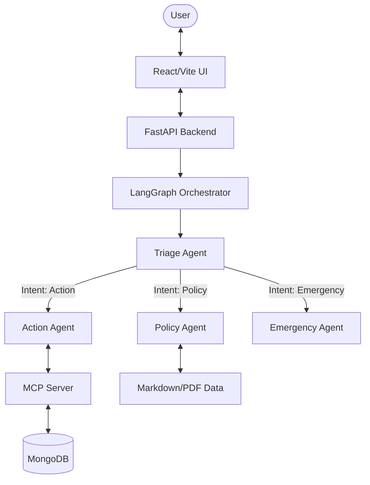

# MedBot Clinic Portal

MedBot is an intelligent, multi-agent autonomous medical receptionist designed to automate clinic administrative workflows, answer policy questions, and escalate medical emergencies. Built with LangGraph, Model Context Protocol (MCP), and a modern React frontend.

## Key Features

*   **Multi-Agent Orchestration (LangGraph):** Routes queries intelligently between specialized agents:
    *   **Triage Agent:** Classifies user intent (Action, Policy, Emergency, General) using conversation history.
    *   **Action Agent:** Uses MCP tools to interact with the database (book, cancel, reschedule).
    *   **Policy Agent:** Answers clinic FAQs and rules using RAG (Retrieval-Augmented Generation).
    *   **Emergency Agent:** Instantly escalates critical health situations without delay.
*   **Persistent Session Memory:** Contextual awareness across multi-turn conversations, allowing users to provide booking details naturally over time.
*   **Model Context Protocol (MCP):** Standardized, secure tool execution layer connecting the LLM to MongoDB for patient records.
*   **Live Activity Feed:** Real-time visual tracing of the LLM's thought process and tool executions in the UI.
*   **Voice Integration:** Manual push-to-talk voice input via browser SpeechRecognition API.
*   **Comprehensive Testing:** 5-layer evaluation suite including unit tests, integration tests, E2E scenarios, LLM-as-judge quality evaluations, and concurrency stress tests.

## System Architecture



## Getting Started

### Prerequisites
*   Node.js v18+
*   Python 3.10+
*   MongoDB Atlas cluster (or local instance)
*   LLM API Key (defaults to Gemini via LiteLLM)

### 1. Environment Setup

Create a `.env` file in `backend/`:
```env
MONGODB_URI="mongodb+srv://<user>:<pass>@<cluster>.mongodb.net/?retryWrites=true&w=majority"
LITELLM_MODEL="gemini/gemini-3.5-flash"
GEMINI_API_KEY="your_api_key"
```

### 2. Backend Setup
```bash
cd backend
python -m venv venv
source venv/bin/activate
pip install -r requirements.txt # (Requires fastapi, uvicorn, langgraph, litellm, pymongo, mcp)

# Run the server (runs on port 8001)
python main.py
```

### 3. Frontend Setup
```bash
cd frontend
npm install

# Run the dev server (runs on port 5173)
npm run dev
```

## Testing and Evaluation

MedBot features a robust 5-layer testing suite located in `backend/tests/`:

1.  **Unit Tests:** Tests MCP tools and routing logic in isolation using `mongomock`.
2.  **Integration Tests:** Validates session memory persistence and FastAPI endpoint contracts.
3.  **End-to-End Tests:** Tests full conversation flows (booking, cancelling, emergency) using the real LLM and MongoDB.
4.  **LLM Evaluation:** Uses an LLM-as-judge to score response quality (Accuracy, Empathy, Completeness, Safety).
5.  **Performance Tests:** Validates latency SLAs and concurrency isolation under load.

Run tests using:
```bash
cd backend
pytest tests/unit tests/integration tests/e2e -v
```

## Project Structure

```text
medibot/
├── backend/
│   ├── main.py              # FastAPI server & Session Store
│   ├── med_agents.py        # LangGraph definitions & Agent prompts
│   ├── med_mcp.py           # Model Context Protocol tools & MongoDB integration
│   ├── data/                # Knowledge base (clinic_policies.md)
│   └── tests/               # 5-layer testing suite
└── frontend/
    ├── src/
    │   ├── App.tsx          # Main UI layout
    │   ├── ChatWindow.tsx   # Message rendering & Voice input
    │   ├── InfoPanel.tsx    # Live Activity feed
    │   └── api.ts           # Backend integration
    └── index.html
```
